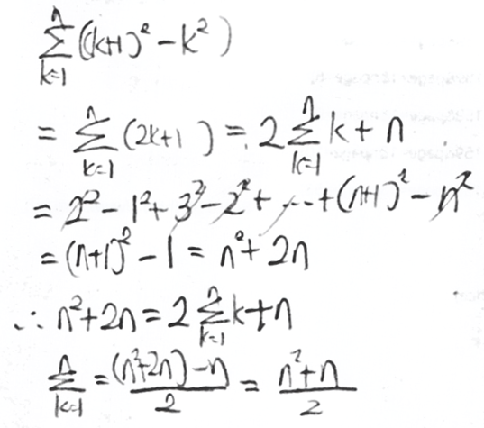
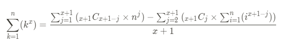

# 시그마

수업 시간에 자연수 거듭제곱의 합 공식을 선생님께서 유도하시는 것을 보고, 그 전까지는 공식을 그냥 아무 생각 없이 외워서 썼었었는데 이게 유도가 된다는 사실에 감탄을 금치 못하였다.

선생님께서 "이렇게 하면 네 제곱일 때도 할 수 있겠죠? 너네들은 프로그래밍으로 또 금방 할 수 있을 것 같은데"라고 넌지시 던지신 말씀이 떠올라서(정확하지는 않지만 대충 이런 내용의 말씀을 하셨던 기억이 난다,,),  한 번 이런 걸 프로그래밍으로 짜보는 것도 재밌을 것 같아 해보고 싶었다.

## 1. 공식 유도

시그마 k의 유도



시그마 k^2의 유도


시그마 k^3의 유도


규칙을 찾아보자면,

우선, $\sum_{k=1}^{n}(k)$를 구하기 위해 $\sum_{k=1}^{n}((k+1)^2-k^2)$를 이용했고, 시그마 $\sum_{k=1}^{n}(k^2)$를 구하기 위해 $\sum_{k=1}^{n}((k+1)^3-k^3)$을 이용했다. 

따라서 시그마 $\sum_{k=1}^{n}(k^x)$를 구하기 위해서는 $\sum_{k=1}^{n}((k+1)^{x+1}-k^{x+1})$을 이용할 수 있을 것이다.

그리고, $\sum_{k=1}^{n}(k^2)$를 구하기 위해 $\sum_{k=1}^{n}(k)$ 가 사용되었고, $\sum_{k=1}^{n}(k^3)$을 구하기 위해 $\sum_{k=1}^{n}(k^2)$와 $\sum_{k=1}^{n}(k)$이 사용되었음울 알 수 있다.

따라서, $\sum_{k=1}^{n}(k^x)$를 구하기 위해 $\sum_{k=1}^{n}(k^1), \sum_{k=1}^{n}(k^2),\cdots,\sum_{k=1}^{n}(k^{x-2}),\sum_{k=1}^{n}(k^{x-1})$을 알아야 할 필요가 있다.

한편, 맨 아래줄의 식에서 계수를 살펴보면 규칙을 찾을 수 있다.


$\sum_{k=1}^{n}k^x$를 구하려고 할 때, $(n+1)^{x+1}$의 n에 대한 전개식의 계수가 위 그림과 같이 분자와 관련이 있다는 것을 알 수 있고, 분모는 $x+1$과 같다.

$(n+1)^{x+1}$의 n에 대한 전개식의 일반항은 이항정리에 따라

$_{x+1}C_r\times n^{x+1-r}$ 로 조합을 통해 나타낼 수 있으므로, $(n+1)^{x+1}$의 전개식의 각 계수를 구할 수 있고, 결국

$$\sum_{k=1}^{n}(k^x)=\frac{_{x+1}C_{0}\times n^{x+1}+_{x+1}C_{1}\times n^{x}+_{x+1}C_{2}\times n^{x-1}+\cdots +_{x+1}C_{x}\times n^{1}-(_{x+1}C_{2}\times\sum_{i=1}^{n}(i^{x-1})+_{x+1}C_{3}\times\sum_{i=1}^{n}(i^{x-2})+\cdots +_{x+1}C_{x+1}\times\sum_{i=1}^{n}(i^{0}))}{x+1}$$

위와 같이 일반화가 가능해졌다.

$$\sum_{k=1}^{n}(k^x)=\frac{\sum_{j=1}^{x+1}{(_{x+1}C_{x+1-j}\times n^j)}   - \sum_{j=2}^{x+1}{(_{x+1}C_{j}  \times \sum_{i=1}^{n}(i^{x+1-j})  )}}{x+1}$$



시그마로 또 정리해보면 위와 같은 식이 만들어진다.

## 2. 프로그램 구현

```python
from fractions import Fraction
import time
import sys
import copy

class Polynomial():

    def __init__(self, **kwargs):
        if "size" in kwargs:
            self.coef = [Fraction(0)] * kwargs["size"]
        elif "coef" in kwargs:
            self.coef = kwargs["coef"]

        if "char" in kwargs:
            self.char = kwargs["char"]
        else:
            self.char = "x"

    def set(self, _coef):
        self.coef = _coef

    def get_degree(self):
        for i in range(len(self.coef) - 1, -1, -1):
            if self.coef[i] != 0:
                break
        return i

    def add(self, other):

        if len(self.coef) - 1 < other.get_degree():
            self.coef += [Fraction(0)] * (other.get_degree() - len(self.coef) + 1)
        if len(other.coef) - 1 < self.get_degree():
            other.coef += [Fraction(0)] * (self.get_degree() - len(other.coef) + 1)

        for i in range(max(self.get_degree(), other.get_degree()) + 1):
            self.coef[i] += other.coef[i]

    def subtract(self, other):

        if len(self.coef) - 1 < other.get_degree():
            self.coef += [Fraction(0)] * (other.get_degree() - len(self.coef) + 1)
        if len(other.coef) - 1 < self.get_degree():
            other.coef += [Fraction(0)] * (self.get_degree() - len(other.coef) + 1)

        for i in range(max(self.get_degree(), other.get_degree()) + 1):
            self.coef[i] -= other.coef[i]

    def multiple(self, n):
        for i in range(self.get_degree() + 1):
            self.coef[i] *= n

    def divide(self, n):

        for i in range(self.get_degree() + 1):
            self.coef[i] /= n

    def __str__(self):
        result = []
        for i in range(self.get_degree(), -1, -1):
            if self.coef[i] == 0:
                continue
            if i != 0:
                result.append(f"{self.coef[i]}{self.char}^{i}")
            else:
                result.append(f"{self.coef[i]}")
        return " + ".join(result)
```

다항식의 계산이 필요하기 때문에 다항식 클래스(자료형)을 선언해준다.

```python
def in_cache(func):
    cache = {}

    def wrapper(n):

        if n in cache:

            return cache[n]
        else:
            cache[n] = func(n)
            return cache[n]

    return wrapper

@in_cache
def factorial(n):
    return n * factorial(n - 1) if n > 1 else 1

def combination(n, r):
    return factorial(n) // factorial(n - r) // factorial(r)
```

(in_cache 함수는 이전 계산에서 구한 팩토리얼 값을 다시 구하지 않고 저장해뒀다가 꺼내서 쓸 수 있도록 만들었다.)

조합의 수를 구하기 위해 팩토리얼을 사용해야하기 때문에 팩토리얼 함수를 구현한다.

위와 같이 재귀 함수를 이용해서 팩토리얼을 구현할 수 있는데, 

factorial(5)에서 factorial(4)를 호출하고, factorial(4)에서 factorial(3)을 호출하고, 이를 반복하다가 마지막에 factorial(1)을 호출하는 과정에서 수열의 귀납적 정의 부분이 떠올랐다. 수열을 귀납적으로 정의할 때에는 $a_1$을 먼저 정의하고  $a_2, a_3,\cdots,a_{n+1}$ 로 차례대로 정의해나가지만, 프로그래밍의 재귀함수에서는 수열의 귀납적 정의를 거꾸로 뒤집은 듯한 느낌이 들었다. 

[수학적 귀납법과 재귀](https://codingfun.tistory.com/332)

더 찾아보니 실제로도 비슷한 부분이 많다고 해서 흥미로웠다.

```python
@in_cache
def sigma(x):
    if x == 0:
        return Polynomial(coef=[Fraction(0), Fraction(1)], char="n")
    else:
        temp = [0] * (x + 2)
        for i in range(x + 1, 0, -1):
            temp[i] = combination(x + 1, x + 1 - i)
        p1 = Polynomial(coef=temp, char="n")

        p2 = Polynomial(size=x + 1, char="n")
        for i in range(x - 1, -1, -1):
            temp_p = sigma(i)
            temp_p2 = copy.deepcopy(temp_p)
            temp_p2.multiple(combination(x + 1, x + 1 - i))
            p2.add(temp_p2)

        p1.subtract(p2)

        p1.divide(x + 1)

        return p1
```

그리고 마지막으로 시그마 결과를 구할 시그마 함수를 구현했다.

sigma(x)는 $\sum_{k=1}^{n}(k^x)$를 의미한다.

위에서 찾은 $\sum_{k=1}^{n}(k^x)$를 구하기 위해 $\sum_{k=1}^{n}(k^1), \sum_{k=1}^{n}(k^2),\cdots,\sum_{k=1}^{n}(k^{x-2}),\sum_{k=1}^{n}(k^{x-1})$을 구해야하는 규칙에서 알 수 있듯이 sigma(x) 값을 구하기 위해 sigma 함수 안에서 sigma(x-1), sigma(x-2), ... sigma(1) 까지 호출이 되고, 일종의 재귀함수이다.

```python
st = time.time()
sys.setrecursionlimit(10 ** 4)
print(f"sigma k^{i} from k=1 to n: ", sigma(100))
print(time.time() - st, "초")
```

마지막으로 sigma(100) 함수를 실행해본다.

놀랍게도 sigma k^100을 2초 안에 구하였다.


sigma k^100 from k=1 to n:  1/101n^101 + 1/2n^100 + 25/3n^99 + -2695/2n^97 + 298760n^95 + -66698170n^93 + 43232541100/3n^91 + -2987368590010n^89 + 592545208316600n^87 + -1909010939318560231/17n^85 + 60927624576260699950/3n^83 + -10503770178403996919537/3n^81 + 574696979476592789539800n^79 + -89701724868851868404757210n^77 + 13296745470530926863904296852n^75 + -1869298239768618416234153813290n^73 + 248870955751990847260270884407400n^71 + -1065245686771269279784908613651828005/34n^69 + 3723652407297582727619274890591931075n^67 + -10844299000116828980379757772973769420469/26n^65 + 43950288418050613210495571589828389262800n^63 + -4348447505694585428839166185138223415249684n^61 + 403139711179170251736670257248480111641926600n^59 + -34944260063316672143127900206016265956506516820n^57 + 2825393845314372316887963516463774302220183874480n^55 + -46975128963737486419489164499794297560673231041202090/221n^53 + 14838677083702274079364344314958348779821717660137900n^51 + -958463607702055700662952442255558159708363131670845130n^49 + 57102248319760803358389861613269821873306861123018474800n^47 + -3127153223428501512572222954783017354698250212191091945572n^45 + 156839198684220220595062954768424384099662857573873761392200n^43 + -93273006623793637434656479802977293641893710056414115793830132/13n^41 + 298055222117767447988694875776788702575308931452828672542296400n^39 + -380420681562789081339436627697748498619486609696130138245054547645/34n^37 + 377511069257143967197314136886615170865786408764196373626268649635n^35 + -22758671683254934243234770245768111655371809025564559292966948184145/2n^33 + 304383493005866429515905139920856508495517057169598168611307541714600n^31 + -93215398532963113031284566771666289746833192047887884379325411297276490/13n^29 + 147482537396120605270641214092320919218664984298368495230915199366025300n^27 + -13112574861745373977119865065563790341936971501269597493806710307275562234/5n^25 + 39857448167724145521712375634202721882854746999642509687138048831663608600n^23 + -8684587426344073606489504709883050170678418405635672010429984157277666084023/17n^21 + 16304634906294224258925539055711850026937478314146500355475130833028845746350/3n^19 + -612067818251686839120746668057583204003010059302601007211600982133792394509295/13n^17 + 324388433491984944852419075920450620931865462636226130063940688368734730163320n^15 + -1725539552167813151807602972961047761861449443882732089672204732211086637590530n^13 + 225010984573490896048358130480328881791747873028668541553377868767760647319540900/33n^11 + -56995948223784756021697384698478769187481110881793715780290371409596995575985270/3n^9 + 34649381621107623485288357725441359210991177541965976048926944361209977534643400n^7 + -16293234618989521508515025064456465992824384487957638029599182473343901462949018943/442n^5 + 18674771685049011296614057325260991542019103825338734064995339343748060441015725n^3 + -94598037819122125295227433069493721872702841533066936133385696204311395415197247711/33330n^1


[sigma k^100 from k=1 to n - Wolfram|Alpha](https://www.wolframalpha.com/input/?i=sigma+k%5E100+from+k%3D1+to+n)

울프람 알파와 비교해보니 정확하다는 것을 알 수 있다.

```
k^1:  1/2n^2 + 1/2n^1
k^2:  1/3n^3 + 1/2n^2 + 1/6n^1
k^3:  1/4n^4 + 1/2n^3 + 1/4n^2
k^4:  1/5n^5 + 1/2n^4 + 1/3n^3 + -1/30n^1
k^5:  1/6n^6 + 1/2n^5 + 5/12n^4 + -1/12n^2
k^6:  1/7n^7 + 1/2n^6 + 1/2n^5 + -1/6n^3 + 1/42n^1
k^7:  1/8n^8 + 1/2n^7 + 7/12n^6 + -7/24n^4 + 1/12n^2
k^8:  1/9n^9 + 1/2n^8 + 2/3n^7 + -7/15n^5 + 2/9n^3 + -1/30n^1
k^9:  1/10n^10 + 1/2n^9 + 3/4n^8 + -7/10n^6 + 1/2n^4 + -3/20n^2
k^10:  1/11n^11 + 1/2n^10 + 5/6n^9 + -1n^7 + 1n^5 + -1/2n^3 + 5/66n^1
k^11:  1/12n^12 + 1/2n^11 + 11/12n^10 + -11/8n^8 + 11/6n^6 + -11/8n^4 + 5/12n^2
k^12:  1/13n^13 + 1/2n^12 + 1n^11 + -11/6n^9 + 22/7n^7 + -33/10n^5 + 5/3n^3 + -691/2730n^1
k^13:  1/14n^14 + 1/2n^13 + 13/12n^12 + -143/60n^10 + 143/28n^8 + -143/20n^6 + 65/12n^4 + -691/420n^2
k^14:  1/15n^15 + 1/2n^14 + 7/6n^13 + -91/30n^11 + 143/18n^9 + -143/10n^7 + 91/6n^5 + -691/90n^3 + 7/6n^1
k^15:  1/16n^16 + 1/2n^15 + 5/4n^14 + -91/24n^12 + 143/12n^10 + -429/16n^8 + 455/12n^6 + -691/24n^4 + 35/4n^2
```

혹시 규칙이 있나 싶어 k^15 까지 차례로 나열해보았는데, 나름의 규칙이 있긴 했다.

가장 차수가 높은 항의 계수는 1/2, 1/3, 1/4, 1/5.... 의 규칙을 따랐다.

두 번째로 차수가 높은 항의 계수는 모두 1/2 였다.

세 번째로 차수가 높은 항의 계수는 k^2일 때 1/6으로 시작하여 1/12씩 증가하는 모습을 보였다.

가장 차수가 작은 항의 차수는 1,2,1,2,1... 로 반복되는 규칙을 보였다.

의미가 있어보이지는 않지만 이런 규칙도 있다는게 신기했다.

## 3. 마치며


시그마 k^x 의 점화식을 위와 같이 나타낼 수도 있다. 시그마 k^x의 전개식의 계수에는 나름의 규칙이 있었고, 더 찾아보고 싶기도 하다.

프로그래밍에서 사용하는 재귀함수와 수학적 귀납법에는 상당한 관련이 있다.

파이썬이 아닌 다른 언어로 짜거나 직접 구현한 다항식 클래스와, import한 분수 모듈을 갈아 엎는다면 속도 향상을 더 기대해볼 수 있을 것 같다.
